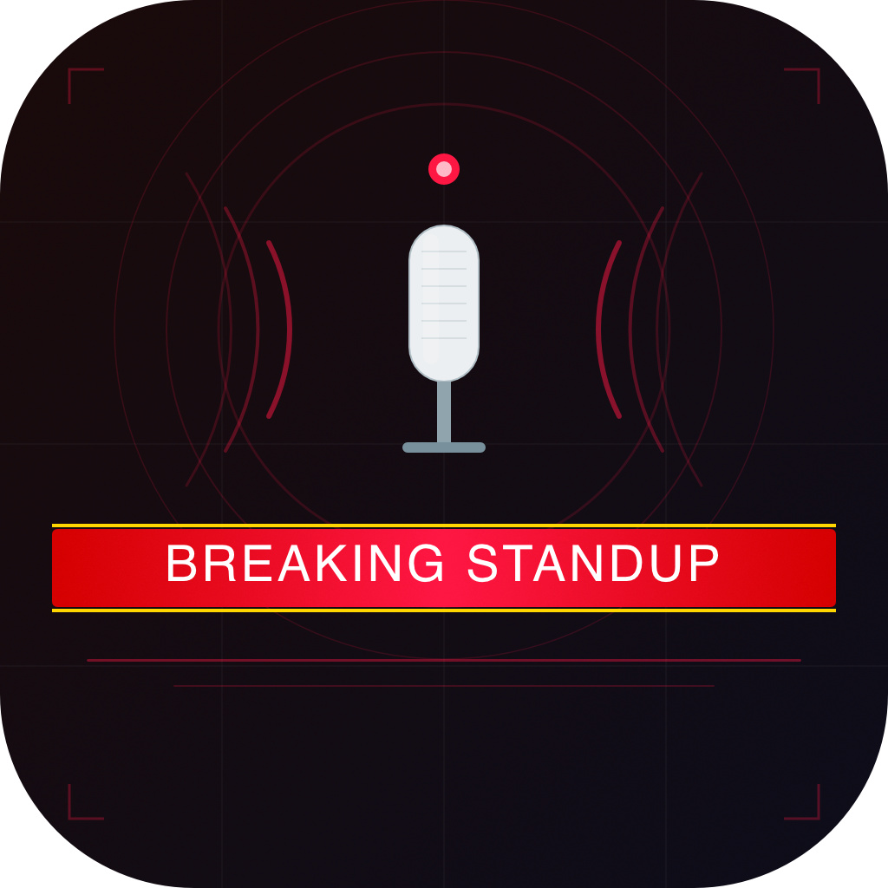
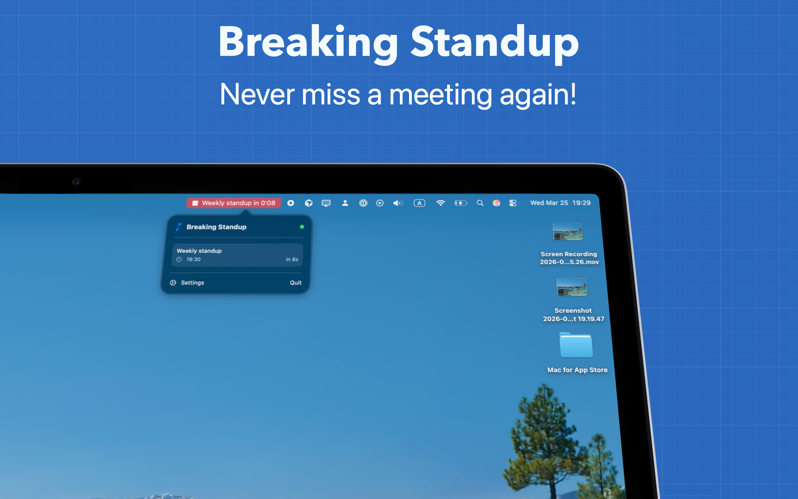
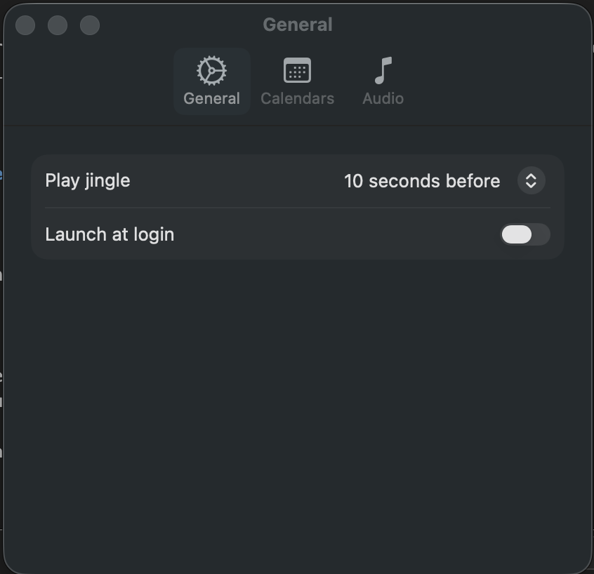
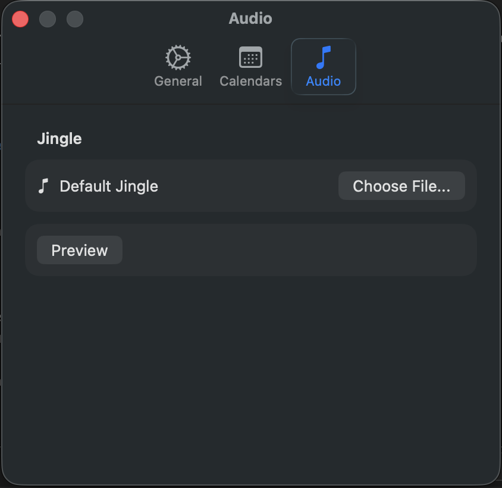

# Breaking Standup

  

A macOS menu bar app that plays a jingle before your meetings start. Never be late to standup again.

[Available in the App Store now](https://apps.apple.com/de/app/breaking-standup/id6761130346?l=en-GB&mt=12)

## Features

- Lives in your menu bar, stays out of your way
- Plays a jingle before meetings start with configurable lead time
- Shows current and upcoming meetings at a glance
- Visual countdown with pulsing status bar animation
- Use the built-in jingle or pick your own audio file
- Choose which calendars to monitor
- Launch at login support
- Lightweight and private — your calendar data never leaves your Mac

## Screenshots

| Menu Bar | Settings (General) | Settings (Audio) |
|:---:|:---:|:---:|
|  |  |  |

## Requirements

- macOS 14.0+
- Calendar access permission

## Building

Open `BreakingStandup.xcodeproj` in Xcode and build (Cmd+R).

The project uses [XcodeGen](https://github.com/yonaskolb/XcodeGen) — run `xcodegen generate` after modifying `project.yml`.

## Privacy

Breaking Standup reads your calendar locally and does not collect or transmit any data. See [Privacy Policy](PRIVACY.md).

## License

MIT — see [LICENSE](LICENSE) for details.
